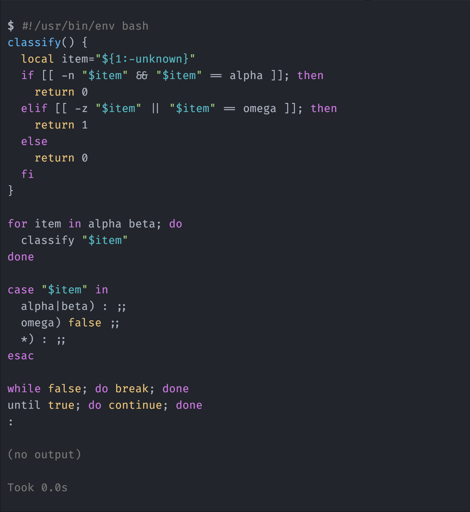

<div align="center">

# pi-pretty-bash

> **Bash tool calls should look like Bash.**

[](https://github.com/earendil-works/pi)
[](https://www.npmjs.com/package/@giladbarnea/pi-pretty-bash)
[](LICENSE)
[](https://www.typescriptlang.org/)

`pi-pretty-bash` adds theme-aware syntax colors to Bash tool calls in Pi's TUI.

</div>

<p align="center">
  
</p>

## Pi already had the right highlighter

Pi highlights fenced Bash blocks in Markdown well. Its SDK exports that same highlighter as `highlightCode()`.

This extension sends each Bash command through `highlightCode(command, "bash")`. The colors therefore match Pi's active theme and Markdown output.

The extension does not ship another Bash grammar or import `highlight.js` directly.

## Install

```sh
pi install npm:@giladbarnea/pi-pretty-bash
```

Start a new Pi session, or run `/reload` in the current session. Every later Bash tool call is highlighted automatically.

Pi may report that the extension overrides the built-in `bash` tool. This warning is expected because tool renderers are attached to tool definitions.

## Only the command display changes

The extension starts from Pi's complete built-in Bash definition. It calls Pi's original renderer, then replaces only the visible command text with highlighted text.

Pi still owns command execution, streaming output, timing, truncation, expansion, error display, and result rendering.

## Compatibility

`pi-pretty-bash` requires Pi `0.83.0` or newer.

Another extension that also replaces the built-in `bash` tool can conflict with this extension. In that case, the last registered Bash tool wins.

## License

[MIT](LICENSE)
